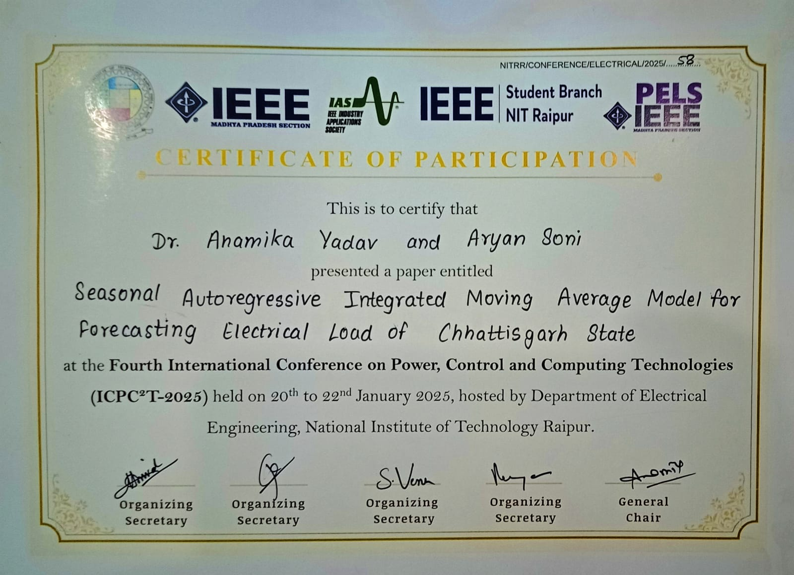

# ICPC2T2025

📄 ICPC2T 2025 Conference Presentation
My work for Fourth International Conference on Power, Control and Computing Technologies (ICPC2T) 2025.

🧪 Highlights
Developed a SARIMA-based forecasting model tailored for 15-minute interval electricity load data.
Achieved high accuracy in seasonal trend detection and short-term load prediction.
Addressed region-specific consumption patterns using real-time data from Chhattisgarh state.
Results presented at ICPC2T 2025, and the paper is published on [IEEE Xplore](https://ieeexplore.ieee.org/document/10958744?source=document-share&dld=Z21haWwuY29t).

